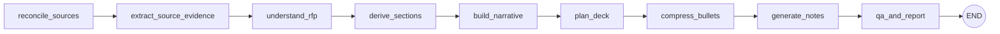

# RFP → Proposal Deck Generator

Turn a complete **RFP package** (PDF/DOCX/XLSX) into a polished, **consulting-grade PowerPoint proposal** — with an
executive narrative, an auto-built slide storyline, optional AI-generated diagrams (behind a human
approval gate), per-slide speaker notes, and a requirement-to-slide traceability report.

Built with **Streamlit** (UI) · **LangGraph** (agent orchestration) · **OpenAI** (reasoning, structured
outputs, image generation) · **python-pptx** (deterministic rendering).

---

## Table of contents

- [What it does](#what-it-does)
- [How it works (the pipeline)](#how-it-works-the-pipeline)
- [Quickstart](#quickstart)
- [Configuration](#configuration)
- [Using the app (3-step wizard)](#using-the-app-3-step-wizard)
- [Optional: build a SharePoint RAG index](#optional-build-a-sharepoint-rag-index)
- [Architecture & design (for developers)](#architecture--design-for-developers)
  - [Design principles](#design-principles)
  - [Project structure](#project-structure)
  - [The agent graph in detail](#the-agent-graph-in-detail)
  - [Data model (schemas)](#data-model-schemas)
  - [The rendering engine](#the-rendering-engine)
  - [Diagram generation & the approval gate](#diagram-generation--the-approval-gate)
  - [Traceability](#traceability)
  - [Logging & observability](#logging--observability)
- [Extending the app](#extending-the-app)
- [Troubleshooting](#troubleshooting)
- [Roadmap](#roadmap)
- [License](#license)

---

## What it does

Given an RFP package and an (embedded) corporate template, the app produces:

- 📊 **A generated proposal deck (`.pptx`)** rendered deterministically from a bundled template, with a
  consistent visual identity (navy title/closing "sandwich", accent rules, styled bullets).
- 🧭 **An executive narrative spine** — the top-down story (value proposition, strategic outcomes,
  solution themes) that drives the slide plan.
- 🖼️ **Optional AI-generated diagrams** for Architecture, Timeline, Delivery/Governance, Team, and
  Solution slides — grounded in the technologies actually named in the RFP, and inserted **only after a
  human approves each one**.
- 🗣️ **Per-slide speaker notes** that coach a presenter on *why* each slide matters to the client.
- ✅ **A traceability report (`.json`)** mapping RFP requirements → slides, flagging any uncovered
  **must-have** requirements.

Key qualities:

- **Grounded, not hallucinated.** Every LLM step uses source-labelled evidence from the base RFP,
  annexures, customer addenda, and clarification responses. Vendor questions alone cannot create
  requirements, and unknowns remain unresolved rather than being invented.
- **Deterministic rendering.** Slides are drawn with `python-pptx` at computed coordinates — no
  "LLM-writes-XML" surprises. The same plan renders the same deck.
- **Human-in-the-loop for anything generative.** Images never reach the deck without explicit approval.

---

## How it works (the pipeline)

The core is a **LangGraph state machine** ([rfp2deck/agent/graph.py](rfp2deck/agent/graph.py)) of nine
nodes. State flows through a single [`AgentState`](rfp2deck/agent/state.py) object; each node enriches it.



| Node | Purpose | Output on state |
|------|---------|-----------------|
| `reconcile_sources` | Prepare source precedence, clarification evidence, and unresolved question references. | `source_reconciliation` |
| `extract_source_evidence` | For large packages, extract structured evidence from bounded fast-model chunks, merge duplicates, and use indexed requirement/source-reference encoding when ordinary JSON exceeds the final budget. Small packages bypass this step. | `source_evidence`, `evidence_text` |
| `understand_rfp` | Extract a structured, non-speculative understanding of the RFP (summary, requirements, risks, assumptions, **named technologies**). | `understanding` |
| `derive_sections` | Classify the RFP into a section taxonomy to guide narrative flow. | `section_map` |
| `build_narrative` | Build the **executive narrative spine** (value proposition, strategic outcomes, solution themes). | `narrative` |
| `plan_deck` | Ask the model for a `DeckPlan`, then **deterministically post-process** it (see below). | `deck_plan` |
| `compress_bullets` | Editorial pass: tighten bullets to executive-grade language. Best-effort; never fails the run. | `deck_plan` (bullets) |
| `generate_notes` | Write per-slide speaker notes (fast model), with deterministic fallback. | `deck_plan` (notes) |
| `qa_and_report` | Build the requirement→slide traceability report. | `report` |

`plan_deck` is where most of the "consulting judgement" lives. After the LLM returns a `DeckPlan`, it is
refined by a series of pure functions in [rfp2deck/agent/nodes.py](rfp2deck/agent/nodes.py):

1. **`ensure_required_slides`** — guarantees the consulting spine exists (Title, Agenda, Executive
   Summary, Customer Context, Requirements, Architecture, Delivery, Timeline, Risks, Team, Commercials,
   Next Steps). Uses **fuzzy archetype matching** so it doesn't add near-duplicates of slides the model
   already produced.
2. **`order_deck`** — sorts slides into a narrative order (Title → Agenda → Exec Summary → … → Next Steps).
3. **`enrich_slide_detail`** — upgrades thin context/requirements slides with **grounded sub-points**
   drawn from the RFP, and **sanitizes the Next Steps slide** to supplier-driven calls to action (never
   bid logistics).
4. **`polish_deck_text`** — light normalization (trim, de-dupe spacing, cap bullet counts).
5. **`ensure_diagrams_for_key_slides`** — attaches **RFP-grounded diagram prompts** to visual slides
   (unapproved by default).

> **Slide count is agent-decided.** There is no hard min/max; the planner is instructed to right-size the
> deck to the proposal and avoid padding or near-duplicate slides.

After the graph runs, the UI optionally generates/approves diagrams and then calls the renderer
([rfp2deck/rendering/pptx_renderer.py](rfp2deck/rendering/pptx_renderer.py)) to produce the `.pptx`.

---

## Quickstart

### Prerequisites

- **Python 3.10+**
- An **OpenAI API key** with access to the configured models (reasoning, fast, embeddings, and
  the configured image model for diagrams)

### 1) Create & activate a virtual environment

**Windows (PowerShell)**
```powershell
python -m venv .venv
.venv\Scripts\Activate.ps1
```

**macOS / Linux**
```bash
python -m venv .venv
source .venv/bin/activate
```

### 2) Install dependencies

```bash
pip install -r requirements.txt
```

### 3) Configure environment

```bash
cp .env.example .env        # Windows: copy .env.example .env
```

Edit `.env` and set at least `OPENAI_API_KEY` (see [Configuration](#configuration)).

### 4) Run the app

```bash
streamlit run app/rfp2deck_app.py
```

…or use the helper script on Unix-like shells:

```bash
./run.sh
```

The app is **password-gated** when `APP_PASSWORD` is set (recommended for any public/shared deployment).
Leave it empty for local-only use.

---

## Configuration

All configuration is via environment variables (loaded from `.env`). See
[rfp2deck/core/config.py](rfp2deck/core/config.py).

| Variable | Default | Purpose |
|----------|---------|---------|
| `OPENAI_API_KEY` | *(required)* | OpenAI authentication. |
| `OPENAI_MODEL_REASONING` | `gpt-5.4-2026-03-05` | Model for understanding, narrative, and deck planning. |
| `OPENAI_MODEL_FAST` | `gpt-5.4-mini-2026-03-17` | Faster model for bounded evidence extraction and speaker notes. |
| `OPENAI_IMAGE_MODEL` | `gpt-image-2` | Model for AI-generated diagram images. |
| `OPENAI_EMBEDDINGS_MODEL` | `text-embedding-3-large` | Embeddings for RAG retrieval. |
| `OPENAI_TIMEOUT_S` | `120` | Per-request timeout (seconds). |
| `OPENAI_RETRY_ATTEMPTS` | `3` | Attempts for retryable OpenAI transient errors. |
| `OPENAI_RETRY_BASE_WAIT_S` | `5` | Initial application-level retry delay; subsequent attempts use exponential backoff. |
| `OPENAI_RETRY_MAX_WAIT_S` | `90` | Maximum retry wait when OpenAI returns `Retry-After` / `retry_after`. |
| `OPENAI_STRUCTURED_STREAMING` | `false` | Opt into streaming for structured Responses calls; non-streaming is more stable for large RFP prompts. |
| `OPENAI_REASONING_EFFORT_HIGH` | `high` | Effort used by RFP understanding and narrative calls. |
| `OPENAI_REASONING_EFFORT_MEDIUM` | `medium` | Effort used by section classification and bullet compression calls. |
| `OPENAI_REASONING_EFFORT_LOW` | `low` | Effort used by speaker-notes calls. |
| `OPENAI_REASONING_EFFORT_DECK_PLAN` | `medium` | Dedicated DeckPlan effort; avoids coupling a large structured-output call to the high-effort understanding pass. |
| `OPENAI_DECK_PLAN_TIMEOUT_S` | `420` | Per-attempt timeout for DeckPlan generation. |
| `OPENAI_DECK_PLAN_RAG_MAX_CHARS` | `18000` | Maximum ranked reusable-context characters included in the DeckPlan prompt. |
| `OPENAI_DECK_PLAN_LAYOUT_LIMIT` | `64` | Maximum relevant template layouts exposed to DeckPlan; full layout selection remains deterministic in the renderer. |
| `OPENAI_DECK_PLAN_PROMPT_MAX_CHARS` | `30000` | Switch to compact DeckPlan prompting above this prompt size; useful for corporate proxies with request-body limits. |
| `OPENAI_DECK_PLAN_CHUNKED` | `true` | Generate the DeckPlan in small section batches to avoid corporate proxy request-size limits while preserving proposal depth. |
| `OPENAI_DECK_PLAN_BATCH_SIZE` | `4` | Number of proposal sections expanded per DeckPlan batch call. Lower this if a proxy blocks larger request bodies. |
| `OPENAI_UNDERSTANDING_DIRECT_MAX_CHARS` | `180000` | Maximum source-package size sent directly to RFPUnderstanding; larger packages use chunk extraction. |
| `OPENAI_UNDERSTANDING_EVIDENCE_CHUNK_CHARS` | `55000` | Maximum characters per source-aware evidence extraction call. |
| `OPENAI_UNDERSTANDING_EVIDENCE_MAX_CHARS` | `180000` | Final merged-evidence budget for the RFPUnderstanding prompt. |
| `OPENAI_UNDERSTANDING_EVIDENCE_WORKERS` | `2` | Concurrent bounded evidence calls; keep low to avoid rate and service pressure. |
| `OPENAI_UNDERSTANDING_EVIDENCE_TIMEOUT_S` | `300` | Timeout for each evidence extraction call. |
| `OPENAI_UNDERSTANDING_EVIDENCE_CACHE` | `true` | Cache source-chunk structured evidence under `.data/evidence_cache` so downstream retries do not repeat extraction calls. |
| `APP_DATA_DIR` | `.data` | Base directory for indexes/outputs/reports. |
| `HCLTECH_TEMPLATE_PATH` | `templates/hcltech_expanded_v5.potx` | Corporate template path. Defaults to the bundled, repo-relative HCLTech `.potx` (resolved against the project root, so it works on any host). Override with an absolute path or another `.pptx`/`.potx` if needed. |
| `TEMPLATE_CACHE_DIR` | `.data/templates` | Cache directory for PPTX files generated from POTX templates. |
| `APP_PASSWORD` | *(empty)* | If set, the UI requires this password before use. |
| `SP_TENANT_ID` / `SP_CLIENT_ID` | *(empty)* | Azure AD app for SharePoint device-code auth. |
| `SP_SCOPES` | `Files.Read.All,Sites.Read.All` | Microsoft Graph scopes for SharePoint indexing. |
| `LOG_LEVEL` | `INFO` | Logging verbosity (`DEBUG`/`INFO`/`WARNING`/…). |
| `LOG_FILE` | `logs/rfp2deck.log` | Rotating log file path (set empty to disable). |
| `LOG_VERBOSE_LIBS` | *(off)* | Set `1`/`true` to stop silencing chatty libraries (httpx, openai, …). |

> Model names are configurable on purpose — point them at whatever models your account has access to.

---

## Using the app (3-step wizard)

The corporate template is configured with `HCLTECH_TEMPLATE_PATH`. It **defaults to the bundled
`templates/hcltech_expanded_v5.potx`**, a repo-relative path that is resolved against the project root,
so the app renders with the official HCLTech Expanded Version template out of the box — locally, in WSL,
and on deployment platforms — without any host-specific configuration. When a `.potx` is configured, the
app creates a cached PPTX-compatible copy under `TEMPLATE_CACHE_DIR` and renders from that cache. You do
**not** upload a template in the UI; you only provide the RFP and, optionally, reusable content.

To override the default, point `HCLTECH_TEMPLATE_PATH` at another `.pptx`/`.potx`. Relative paths are
resolved against the project root; absolute paths are used as-is (Windows drive-letter paths are
auto-mapped to `/mnt/<drive>/...` under WSL). Quote values that contain spaces:

```env
# Bundled default (portable — recommended):
HCLTECH_TEMPLATE_PATH=templates/hcltech_expanded_v5.potx
# Absolute override (Windows / WSL):
# HCLTECH_TEMPLATE_PATH='C:\Users\...\Expanded Version 5.0.potx'
# HCLTECH_TEMPLATE_PATH='/mnt/c/Users/.../Expanded Version 5.0.potx'
```

### Deploying to Streamlit Cloud (or similar)

Because the template is committed and referenced by a repo-relative path, no template configuration is
required on the host. If you ever need to override it, set `HCLTECH_TEMPLATE_PATH` as a top-level key in
the Streamlit **Secrets** manager (App → Settings → Secrets, or `.streamlit/secrets.toml`) — Streamlit
exposes top-level secrets as environment variables, so the existing `os.getenv` lookup picks it up. On
other platforms, set it as a normal container/service environment variable.

### Sidebar settings
- **Deck Mode** — *Bid Defense (Core Only)* or *Full Proposal (Core + Appendix)*.
- **Generate speaker notes** — toggle per-slide presenter notes.
- **Enable diagram generation** — toggle the AI-diagram step (with approval).
- **Diagram model / size / quality** — controls for image generation (`OPENAI_IMAGE_MODEL` by default).
- **Build/Update RAG index** — index an uploaded reusable-content `.txt` for retrieval.

### Step 1 — Upload & Plan
Upload the **primary RFP and annexures (PDF/DOCX/XLSX)**. Upload customer-issued clarification Q&A
and addenda in the separate authoritative-source control, and place non-binding material under
supporting documents. The app preserves page, paragraph/table-row, or workbook sheet/row locators,
then applies source precedence before producing the **deck plan** and **traceability report**.

For clarification workbooks, use recognisable question and answer headings such as `Vendor Question`
and `Customer Response`. An unanswered vendor question remains non-authoritative and unresolved.

### Step 2 — Diagrams & Approval (if enabled)
Click **Generate / Regenerate Diagrams**. Each proposed diagram is rendered as a preview image. **Tick
the approval checkbox** for each diagram you want in the deck — **only approved diagrams are inserted**.

### Step 3 — Render & Download
Click **Render PPTX**. The renderer builds the deck deterministically (themed slides, fitted text,
approved diagrams, embedded speaker notes). Download:

- the generated **`.pptx`**, and
- the **`traceability.json`** report.

Speaker notes are embedded on each slide's notes page (no separate download needed).

---

## Optional: build a SharePoint RAG index

You can build a persistable FAISS index from PPTX proposals stored in SharePoint, for reuse as retrieval
context. Authentication uses **device-code flow** (set `SP_TENANT_ID` and `SP_CLIENT_ID` first).

```bash
python -m rfp2deck.rag.sharepoint_index \
  --site-url "https://contoso.sharepoint.com/sites/Proposals" \
  --folder-path "Shared Documents/Proposals"
```

Useful flags: `--library-name`, `--extensions pptx`, `--max-files 200`, `--out-dir .data/indexes/default_rag`.

> Note: the Streamlit UI's RAG path currently builds an **in-memory** index from the uploaded `.txt`. The
> SharePoint CLI persists an index to disk for programmatic reuse; wiring it into the UI is a small,
> well-scoped enhancement (see [Roadmap](#roadmap)).

---

## Architecture & design (for developers)

### Design principles

1. **Separation of "what to say" from "how to draw it."** The LLM/agent layer decides *content and
   structure* (`DeckPlan`); the renderer is a deterministic function of that plan. This makes output
   reproducible and debuggable, and keeps prompt changes from silently breaking layout.
2. **Structured outputs over free text.** Every model call returns JSON validated against a Pydantic
   schema via the OpenAI Responses API in *strict* mode ([rfp2deck/llm/structured.py](rfp2deck/llm/structured.py)).
   No regex-scraping of prose.
3. **Grounding & guardrails.** Prompts forbid invention, require unknowns to be flagged, and enforce
   consulting norms (assertion-style titles, executive summary = win thesis, Next Steps = supplier
   actions, diagrams named after real technologies).
4. **Human-in-the-loop for generative media.** Diagrams are proposed but never auto-inserted.
5. **Fail soft on enhancements.** Optional passes (bullet compression, speaker notes) are wrapped so a
   failure logs a warning and keeps the deck, rather than aborting the run.
6. **Deterministic, defensive rendering.** The renderer computes layout from the actual slide size,
   contains images within boxes, fits fonts to avoid overflow, and never lets a cosmetic step crash the
   build.

### Project structure

```
rfp2deck_v1.0/
├─ app/
│  └─ rfp2deck_app.py            # Streamlit UI: password gate + 3-step wizard
├─ rfp2deck/
│  ├─ agent/
│  │  ├─ graph.py                # LangGraph: 9-node pipeline wiring
│  │  ├─ nodes.py                # Node fns + deterministic deck post-processing
│  │  ├─ prompts.py              # All prompt templates
│  │  └─ state.py                # AgentState (Pydantic) shared across nodes
│  ├─ core/
│  │  ├─ config.py               # Settings from env (.env)
│  │  ├─ logging.py              # Rich console + rotating file logging
│  │  └─ schemas.py              # Pydantic schemas (structured outputs + deck model)
│  ├─ diagrams/
│  │  └─ generator.py            # OpenAI image generation → PNG bytes
│  ├─ ingestion/
│  │  ├─ pdf_parser.py           # PDF → text (PyMuPDF)
│  │  ├─ docx_parser.py          # DOCX → text (python-docx)
│  │  ├─ xlsx_parser.py          # XLSX → sheet/row evidence + clarification Q&A
│  │  ├─ source_package.py       # Source roles, authority, precedence, prompt package
│  │  ├─ pptx_parser.py          # PPTX → text (python-pptx)
│  │  └─ deck_analyzer.py        # Template layout/placeholder analysis
│  ├─ llm/
│  │  ├─ openai_client.py        # Cached OpenAI client
│  │  └─ structured.py           # Responses API + strict JSON-schema dereferencing
│  ├─ qa/
│  │  └─ coverage.py             # Requirement → slide traceability report
│  ├─ rag/
│  │  ├─ embeddings.py           # OpenAI embeddings
│  │  ├─ indexer.py              # chunking + FAISS build/save/load
│  │  ├─ retriever.py            # top-k retrieval
│  │  ├─ sharepoint_client.py    # SharePoint device-code auth + Graph helpers
│  │  └─ sharepoint_index.py     # CLI: SharePoint → FAISS index
│  └─ rendering/
│     └─ pptx_renderer.py        # Deterministic PPTX rendering (theme, layout, fit, notes)
├─ templates/
│  └─ *.pptx                       # Optional local PPTX templates
├─ requirements.txt
├─ pyproject.toml
├─ .env.example
└─ run.sh
```

### The agent graph in detail

- **State** ([state.py](rfp2deck/agent/state.py)) carries the source-labelled RFP package,
  `source_documents`, `clarification_records`, `source_reconciliation`, `template_info`, RAG context, and
  every artifact produced along the way (`understanding`, `narrative`, `deck_plan`, `report`), plus UI
  toggles (`deck_mode`, `enable_notes`).
- **Node logging.** Each node is wrapped by `_logged_node`, which logs START/DONE/duration and surfaces
  the active node on failure — invaluable for diagnosing LLM timeouts.
- **`plan_deck` post-processing** is intentionally **not** in the LLM. Required-slide backfill, ordering,
  detail enrichment, text polish, and diagram attachment are pure Python so behavior is testable and
  predictable. Helpers worth knowing:
  - `_build_diagram_prompt(kind, understanding)` — composes a diagram prompt that names the client and the
    technologies extracted from the RFP (`key_technologies`, with a keyword-scan fallback).
  - `_exec_summary_bullets(understanding, narrative)` — Executive Summary = **win thesis**, never logistics.
  - `_sanitize_next_steps(...)` — strips bid logistics / customer-side evaluation activity from Next Steps.
  - `_context_detailed_points` / `_requirements_detailed_points` — turn bare headers into grounded
    headline-plus-sub-point structures.

### Data model (schemas)

Defined in [rfp2deck/core/schemas.py](rfp2deck/core/schemas.py). The important ones:

- **`SourceDocument` / `SourceReconciliation`** — document role, authority, locators, clarification
  records, precedence rules, conflicts, and unresolved customer questions.
- **`RFPUnderstanding`** — effective `requirements[]` with source references, authority, status and
  confidence; superseded and unresolved requirements are retained separately for auditability.
- **`ExecutiveNarrative`** — `value_proposition`, `strategic_outcomes`, `solution_themes`,
  `executive_summary_points`, `mandatory_sections`, `milestone_mapping`.
- **`DeckPlan` → `SlideSpec`** — each slide has `title`, `archetype` (a fixed vocabulary), `bullets`,
  **`detailed_points`** (`BulletPoint` = headline + `sub_points` for two-level bullets), optional
  `table`, optional **`diagram`** (`DiagramSpec`), `notes` (speaker notes), and traceability `rfps[]`.
- **`DiagramSpec`** — `kind`, `prompt`, `approved` (the human gate), `image_path`.
- **`DeckNotes`** — `slide_id → notes` produced by the notes pass.
- **`TraceabilityReport`** — `coverage[]` (requirement → slides) and `uncovered_requirements[]`.

### The rendering engine

[pptx_renderer.py](rfp2deck/rendering/pptx_renderer.py) turns a `DeckPlan` into a `.pptx`:

- **Visual identity ("sandwich").** A navy/accent palette: dark **Title** and **Next Steps** slides, white
  content slides with a navy headline and a thin accent rule. Backgrounds, title colours, and bullet
  glyphs are applied per archetype via `_theme_for`.
- **Line-aware titles.** `_fit_title_font` + `_estimate_title_lines` shrink the headline font and size
  the title box to the actual wrapped line count, so long titles never collide with the diagram below.
- **Two layouts.** Slides with an approved diagram use a **split layout** (image left, text right);
  text-only slides use a full-width body. Both are computed from the real slide dimensions.
- **Nested, styled bullets.** `detailed_points` render as a headline (filled-square glyph) with indented
  sub-points (en-dash glyph) using native DrawingML bullet elements — inserted in schema-valid child
  order so PowerPoint doesn't "repair" the file.
- **Fit-to-box & contain.** Body fonts shrink heuristically to avoid overflow; images are scaled to fit
  their box without distortion or bleed.
- **Speaker notes** are written to each slide's notes page.

> Because `python-pptx` has no real layout engine, overflow handling is heuristic (estimated line
> wrapping by box and font size), not pixel-perfect.

### Diagram generation & the approval gate

- [diagrams/generator.py](rfp2deck/diagrams/generator.py) calls OpenAI image generation
  (`OPENAI_IMAGE_MODEL` by default) and returns PNG bytes.
- The UI generates one image per slide that has a `DiagramSpec`, holds them **in memory**, and shows
  previews. The renderer inserts an image **only if** `diagram.approved` is `True` *and* a matching image
  exists for that `slide_id`. Unapproved diagrams are silently skipped.

### Traceability

[qa/coverage.py](rfp2deck/qa/coverage.py) maps each requirement to the slides whose `rfps[]` reference its
id, and flags any **must-have** requirement with no covering slide. The report is downloadable as JSON.

### Logging & observability

[core/logging.py](rfp2deck/core/logging.py) configures Rich console logging plus a rotating file at
`logs/rfp2deck.log`. Each agent node and the renderer emit structured progress/timing logs; failures are
logged with the active node and a traceback. Tune with `LOG_LEVEL` / `LOG_FILE` / `LOG_VERBOSE_LIBS`.

---

## Extending the app

- **Add a slide archetype.** Add it to `SlideArchetype` in [schemas.py](rfp2deck/core/schemas.py), give it
  a default block in `ensure_required_slides`, a slot in `order_deck`, and (optionally) a theme branch in
  `_theme_for`.
- **Change the look.** Edit the palette constants (`COLOR_PRIMARY`, `COLOR_ACCENT`, …) and `_theme_for`
  in the renderer. Layout geometry lives in `_layout` / `_layout_split`.
- **Tune the writing.** All prompts are in one file, [prompts.py](rfp2deck/agent/prompts.py). Changing
  tone/rules rarely requires touching code, thanks to the content/render split.
- **Add a new diagram kind.** Extend `_build_diagram_prompt` and the `kind` branch in
  `ensure_diagrams_for_key_slides`.
- **Swap models.** Set the `OPENAI_MODEL_*` env vars; no code change needed.

---

## Troubleshooting

| Symptom | Likely cause / fix |
|---------|--------------------|
| `OPENAI_API_KEY is not set` warning, auth errors | Populate `.env` and restart the app. |
| App shows a password box and stops | `APP_PASSWORD` is set; enter it (or unset it for local use). |
| "Corporate template is unavailable" | Set `HCLTECH_TEMPLATE_PATH` to the official HCLTech `.potx` or a converted `.pptx`. |
| Diagrams don't appear in the deck | They weren't **approved** in Step 2, or the image failed to generate. |
| Long titles look tight | Headlines auto-shrink to ≤2 lines; prefer ≤8-word assertion titles for best results. |
| DeckPlan returns 5xx errors or takes many minutes | Keep `OPENAI_REASONING_EFFORT_DECK_PLAN=medium`; the planner now compacts template metadata and uses one explicit retry layer. Check the OpenAI status page if 5xx responses persist. |
| Other slow runs / timeouts | Reasoning passes may use high effort; adjust the node-specific effort or timeout only after checking prompt size and service status. |
| Need detail on a failure | Check `logs/rfp2deck.log`; set `LOG_LEVEL=DEBUG`. |

---

## Roadmap

- Auto-consume the persisted SharePoint FAISS index in the UI retrieval path.
- Make `deck_mode` (Bid Defense vs. Full Proposal + Appendix) drive appendix/section depth explicitly in
  the planner.
- True overflow detection via headless Office/LibreOffice rendering.
- A constrained diagram "grammar" (fixed palette + node/edge schema) instead of free-form image prompts.
- An evaluation harness with golden RFPs for regression testing prompt/render changes.

---

## License

See [LICENSE](LICENSE).
